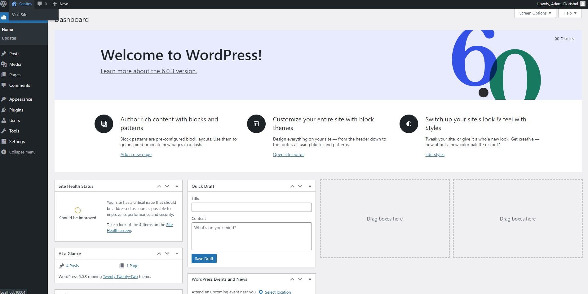
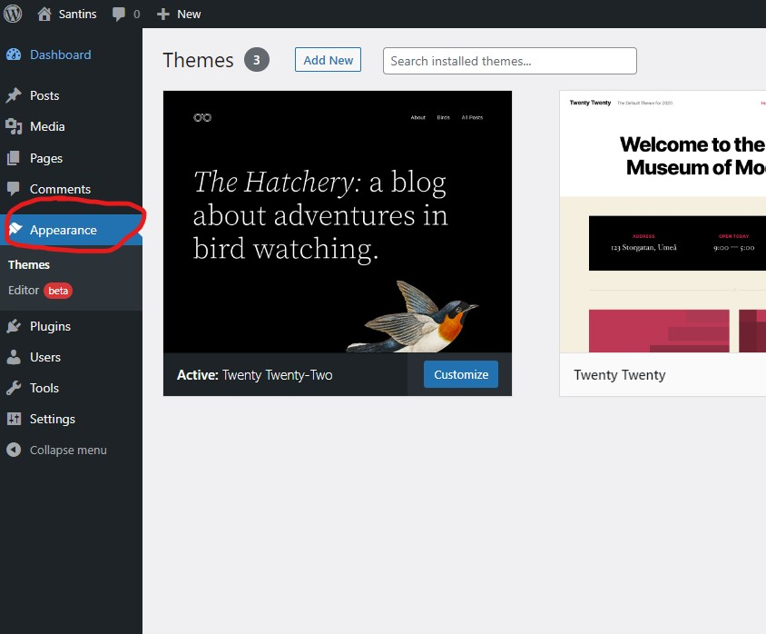
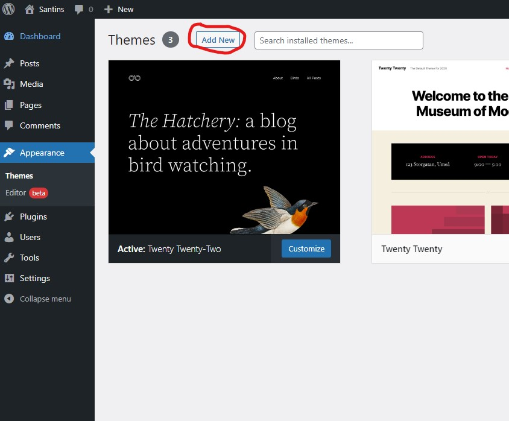
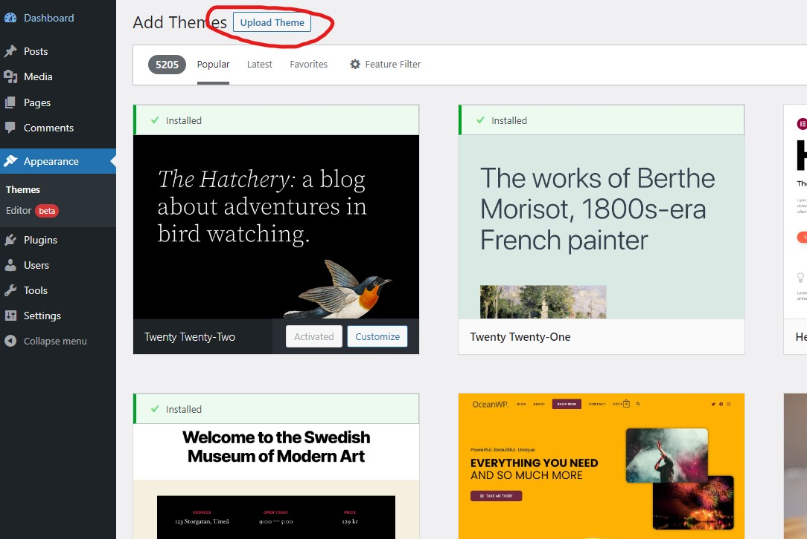
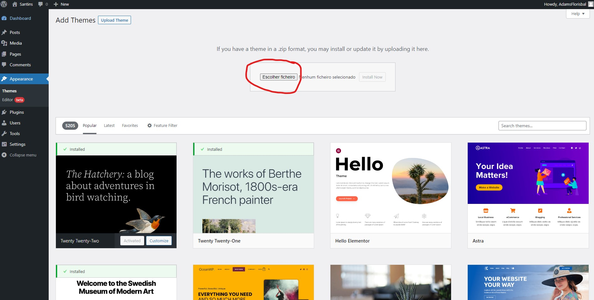
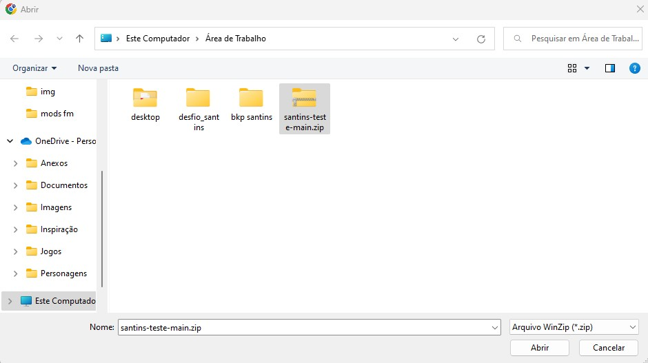
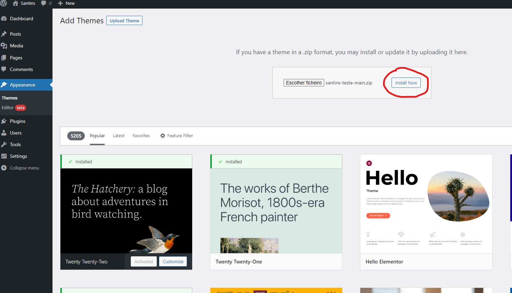
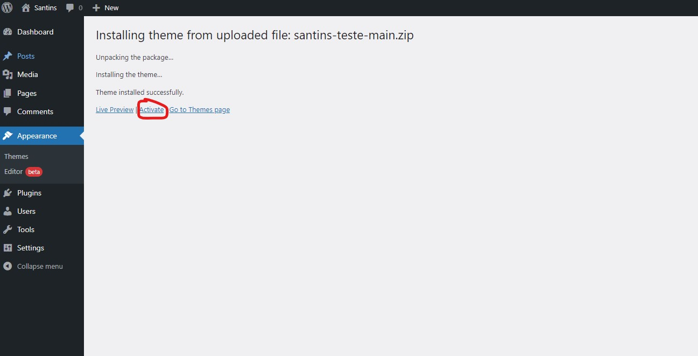
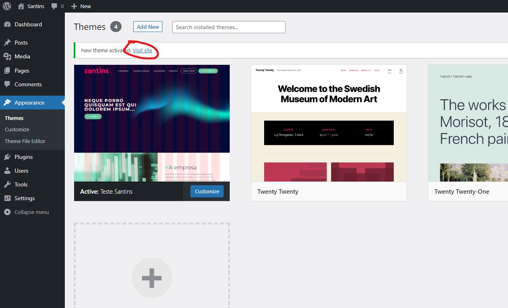
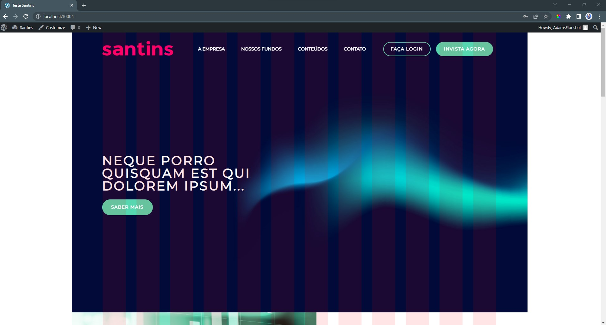

<h1 align="center">
    Teste Santins
</h1>

<h4 align="center">
  Landing page com HTML, CSS, JavaScript e Wordpress
</h4>

  <a href="#rocket-tecnologias">Tecnologias</a>&nbsp;&nbsp;&nbsp;|&nbsp;&nbsp;&nbsp;
  <a href="#information_source-como-usar">Como Usar</a>&nbsp;&nbsp;&nbsp;&nbsp;&nbsp;&nbsp;

<h4 align="left">
  Descrição do projeto
</h4>

Este projeto foi desenvolvido no decorrer de um teste, com o propósito de passar para a segunda fase de um processo seletivo.

Este teste foi desenvolvido com base em uma landing page fictícia em figma:

-  [FIGMA](https://www.figma.com/file/KMLb4aiwRDPF7bZ4ucInsI/Teste-Santins?node-id=1%3A373)

## :rocket: Tecnologias

-  [HTML](https://developer.mozilla.org/pt-BR/docs/Web/HTML)
-  [CSS](https://developer.mozilla.org/pt-BR/docs/Web/CSS/)
-  [JavaScript](https://www.javascript.com/)
-  [PHP](https://www.php.net/)
-  [Worpress](https://wordpress.org/)
-  [MDS web docs](https://developer.mozilla.org/pt-BR/)
-  [Local](https://localwp.com/)

## :information_source: Como usar

Caso você já tenha o wordpress instalado você deve fazer o [DOWNLOAD DO TEMA AQUI](https://github.com/AdamsFlorisbal/santins-teste/archive/refs/heads/main.zip) e seguir os passos abaixo.

- <h5>Abra seu dashboard no wordpress;</h5>

- <h5>No menu lateral clique em appearence;</h5>

- <h5>Em seguida em Add New;</h5>

- <h5>Agora em Upload Theme;</h5>

- <h5>Finalmente em Escolher o ficheiro;</h5>

- <h5>Abra o arquivo que você baixou com nome "santins-teste-main.zip", no meu caso eu salvei na Área de Trabalho;</h5>

- <h5>Clique em Install Now;</h5>

- <h5>Caso a instalação ocorra de forma correta, aparecerá a uma mensagem onde diz que seu tema foi instalado corretamente então é só clicar em Activate;</h5>

- <h5>Para acessar o seu novo tema clique em Visit site;</h5>

- <h5>Pronto, aí está seu novo tema instalado!</h5>

## :information_source: Como instalar o wordpress para desenvolvimento local
Caso você não tenha o Wordpress instalado você deve assistir ao video tutorial [AQUI](https://youtu.be/IUldHIfGyXI).

